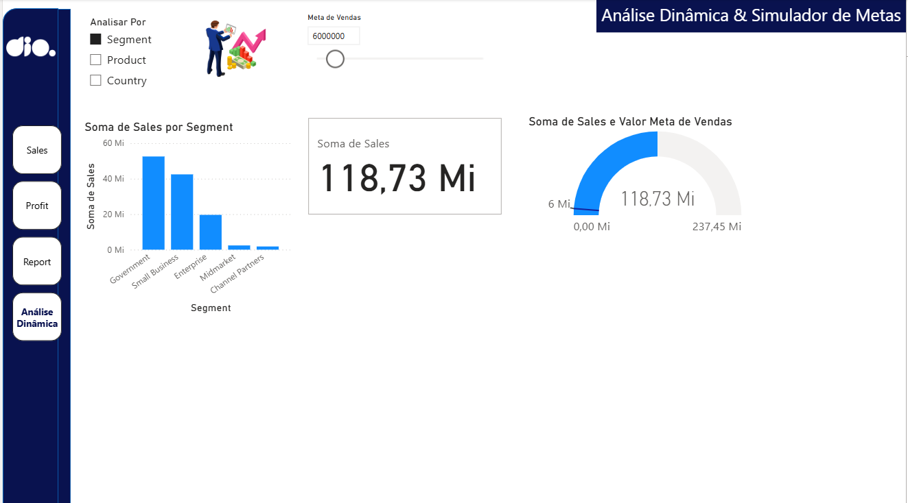

# Desafio DIO: Relatórios Dinâmicos com Parâmetros no Power BI

Este repositório documenta a resolução do segundo desafio da DIO, **"Criando Relatórios Dinâmicos com o uso de Parâmetros no Power BI"**.

O objetivo deste projeto foi adicionar uma nova página de análise a um relatório financeiro existente (criado no desafio anterior). Esta nova página deveria ser totalmente dinâmica, permitindo ao usuário final explorar os dados de forma interativa, como se estivesse em uma apresentação de cliente (foco em *storytelling*).

## 🚀 Relatório Interativo (Power BI Service)

A nova página "Análise Dinâmica" foi integrada ao relatório principal. Você pode interagir com o projeto completo no link abaixo:

**[Clique aqui para acessar o Relatório Interativo no Power BI Service](https://app.powerbi.com/groups/me/reports/50c4b010-ab72-42c3-94c0-25aae4d50f60/1bfaade1c6949e7535e5?experience=power-bi)**

---

## 💡 O Processo de Desenvolvimento (Passo a Passo)

O desafio exigia a criação de pelo menos dois visuais dinâmicos, cada um baseado em um tipo diferente de parâmetro.

### 1. Parâmetro de Categorias (Parâmetro de Campo)

O primeiro requisito era permitir que o usuário alterasse a **categoria** de análise de um gráfico.

* **Implementação:** Foi utilizada a funcionalidade de **"Parâmetro de Campos"** (na guia `Modelagem`).
* **Configuração:** Um parâmetro chamado `Analisar Por` foi criado, contendo os campos `Segment`, `Product` e `Country`.
* **Resultado:**
    1.  O Power BI criou automaticamente uma segmentação de dados (slicer), permitindo ao usuário escolher uma dessas três categorias.
    2.  Um gráfico de colunas ("Soma de Sales") foi adicionado, e seu **Eixo X** foi vinculado a este novo parâmetro `Analisar Por`.
    3.  **Visual Final:** Um gráfico de colunas que muda dinamicamente sua análise (Vendas por Segmento, Vendas por Produto, etc.) com um único clique.

### 2. Parâmetro de Valores (Simulador "What-If")

O segundo requisito era criar um parâmetro "com base em valores (profit, sales, ou outros)".

* **Implementação:** Foi utilizada a funcionalidade **"Intervalo Numérico"** (também em `Modelagem`). Este é o recurso "What-If" (E se?) do Power BI.
* **Configuração:** Um parâmetro chamado `Meta de Vendas` foi criado, com um intervalo numérico (de 0 a 60.000.000).
* **Resultado:**
    1.  O Power BI criou um controle deslizante (slider) na tela e uma medida DAX (`Valor de Meta de Vendas`).
    2.  Um visual de **"Medidor" (Gauge)** foi adicionado.
    3.  O campo **"Valor"** do medidor foi preenchido com a medida `Soma de Sales` (Vendas Reais).
    4.  O campo **"Valor de Destino"** do medidor foi vinculado à medida `Valor de Meta de Vendas` do parâmetro.
    5.  **Visual Final:** Um "velocímetro" que compara as vendas totais (118,73 Mi) com uma meta que o usuário pode simular em tempo real usando o slider.

### 3. Finalização: UI/UX e Storytelling

Para atender ao requisito de "apresentação ao cliente" e manter a consistência visual:

1.  **Menu de Navegação:** O menu lateral padrão (criado no primeiro desafio) foi copiado e colado na nova página "Análise Dinâmica".
2.  **Limpeza de UI:** Os botões redundantes (Home Page, Voltar) foram removidos.
3.  **Storytelling:** Os visuais foram organizados e uma **Caixa de Texto** foi usada para adicionar um título principal claro: **"Análise Dinâmica & Simulador de Metas"**, dando contexto imediato ao usuário sobre o propósito da página.

## 📸 Resultado Final

Abaixo está o layout final da página "Análise Dinâmica", integrando os dois tipos de parâmetros de forma limpa e funcional.

## 🛠️ Conceitos e Recursos Aplicados

* **Software:** Microsoft Power BI Desktop
* **Recursos Avançados:**
    * Parâmetros de Campo (Field Parameters)
    * Parâmetros de Intervalo Numérico (Numeric Range / "What-If" Analysis)
    * DAX (Medidas geradas por parâmetros)
* **Visuais:**
    * Medidor (Gauge)
    * Gráfico de Colunas dinâmico
    * Segmentação de Dados (Slicer)
* **UI/UX:**
    * Design de Navegação Consistente
    * Storytelling com Dados
